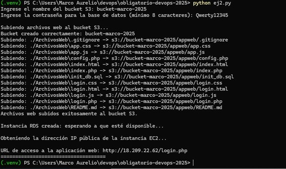
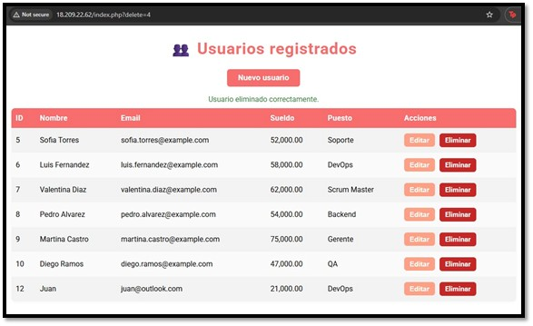

Este archivo contiene la solución completa del Obligatorio de Programación para DevOps 2025, compuesto por:

Ejercicio 1 (Bash):
Script que automatiza la creación de usuarios en Linux a partir de un archivo de entrada, aplicando verificaciones, manejo de errores y opciones adicionales de ejecución.

Incluye:
-	Shell por defecto. 
-	Directorio home. 
-	Comentario asociado al usuario. 
-	Opción para crear el directorio home si no existe. 
-	Además, incluye opciones para: 
-	Informar el resultado de la creación de cada usuario. 
-	Asignar una contraseña común a todos los usuarios. 

Ejercicio 2 (Python + AWS)

Automatización del despliegue completo de una aplicación de Recursos Humanos en AWS, asegurando la correcta gestión de datos sensibles.

Incluye:
-	Preparación del entorno local y archivos de la aplicación.
-	Subida del contenido web a un bucket S3.
-	Creación de Security Groups para aislar la capa web y la base de datos.
-	Aprovisionamiento de una instancia MySQL en AWS RDS con cifrado y backups.
-	Lanzamiento de una instancia EC2 con instalación automática de Apache y PHP.
-	Sincronización de archivos desde S3, configuración del archivo .env y carga    opcional del script SQL inicial.
-	Protección de credenciales mediante inputs y permisos seguros en la instancia.

Requisitos y Modo de uso

Ejercicio 1 (Bash)

Debe ejecutarse en un entorno Linux con:
- bash 4.x o superior

Para crear o modificar usuarios en el sistema, es obligatorio ejecutar el script con privilegios de superusuario:
```bash
sudo ./ej1_crea_usuarios.sh
``` 

Si se ejecuta sin sudo, los comandos useradd y chpasswd fallarán.

El archivo de usuarios debe contener una línea por usuario, con 5 campos separados por ":", respetando este formato:

usuario:comentario:home:crear_home:shell

Requisitos del archivo:

- Debe existir

- Debe ser un archivo regular (-f)

- Debe ser legible (-r)

- Debe tener exactamente 4 “:” por línea

Herramientas del sistema necesarias:

El script utiliza los siguientes comandos disponibles por defecto en Linux:

- useradd → para crear usuarios

- chpasswd → para asignar contraseñas cuando se usa el modificador -c

- echo, wc, tr, set, etc.

En caso de que falten, instalarlos con:
```bash
sudo apt install passwd   # Debian/Ubuntu
sudo yum install shadow-utils   # CentOS/RHEL
```

Ejecución del script

Antes de ejecutar, asegurarse de otorgar permisos:
```bash
chmod +x ej1_crea_usuarios.sh
```
```bash
./ej1_crea_usuarios.sh [-i] [-c contraseña] archivo_usuarios
```

Formato del archivo de entrada (usuarios.txt):

Cada línea debe contener 5 campos, separados por “:”

ejemplo:
```bash
usuario:comentario:home:SI|NO:shell
```


------------------------------------------------------------------------

El script utiliza códigos de salida específicos para identificar fallas:

| Código | Motivo     | Descripción                                |
|--------|------------|--------------------------------------------|
| 10     | Parámetros | Cantidad incorrecta de parámetros          |
| 11     | Parámetros | Falta contraseña tras -c                   |
| 12     | Parámetros | Modificador inválido                       |
| 13     | Archivo    | No se proporcionó archivo de entrada       |
| 20     | Archivo    | El archivo no existe                       |
| 21     | Archivo    | El archivo no es regular                   |
| 22     | Archivo    | Sin permisos de lectura                    |
| 30     | Formato    | Cantidad incorrecta de campos              |
| 31     | Formato    | Campo "SI/NO" inválido                     |

------------------------------------------------------------------------


Requisitos / Dependencias

Para que el script pueda ejecutarse sin problemas, es necesario contar con un entorno previamente configurado tanto a nivel local como en la plataforma de AWS.
En el equipo donde se ejecute el programa se debe disponer de Python 3 y de las librerías necesarias para interactuar con los servicios de la nube. En particular, se utilizan los módulos boto3 y botocore, que permiten crear, administrar y consultar recursos de AWS directamente desde el código. Ambos paquetes pueden instalarse mediante:

pip install boto3 botocore

Además del entorno de Python, se requiere que la AWS CLI esté instalada y correctamente configurada con un usuario que cuente con permisos suficientes para aprovisionar infraestructura. Las credenciales asociadas deben habilitar acciones sobre los servicios utilizados en el despliegue, tales como Amazon S3, EC2 y RDS. Sin estas políticas, el script no podrá crear ni modificar los recursos necesarios.

También es indispensable contar con la carpeta local que contiene los archivos de la aplicación web, la cual el script sincroniza automáticamente hacia el bucket de S3. Dichos archivos deben ubicarse dentro del directorio ArchivosWeb, manteniendo la estructura prevista para que el servidor web pueda procesarlos correctamente.

En conjunto, estas dependencias, tanto de software como de configuración en AWS garantizan que el script pueda ejecutar todas las etapas del despliegue de forma segura, automatizada y sin errores.

------------------------------------------------------------------------
Funcionalidad y medidas de seguridad

El script desarrollado en Python tiene como finalidad automatizar todo el proceso de despliegue de la aplicación de Recursos Humanos dentro de la infraestructura de AWS. Para lograrlo, se emplea la librería boto3, que permite crear y configurar servicios en la nube siguiendo principios de Infraestructura como Código, garantizando un despliegue repetible, ordenado y seguro.

El proceso comienza con la preparación del contenido web: el script verifica la existencia de la carpeta local de la aplicación y carga todos los archivos necesarios en un bucket de Amazon S3. Esto permite que la instancia EC2, que se aprovisionará más adelante, pueda descargar y ejecutar la aplicación sin intervención manual.

Luego, el script crea los grupos de seguridad que definen el flujo de tráfico dentro del entorno. Por un lado, se configura un Security Group para la capa web, permitiendo únicamente tráfico HTTP desde cualquier origen. Por otro, se genera un Security Group específico para la base de datos, el cual restringe completamente las conexiones externas y solo admite solicitudes provenientes del servidor web. Esta separación entre capas reduce significativamente la superficie de ataque y asegura un aislamiento adecuado entre servicios.

A continuación, se provisiona una base de datos MySQL mediante Amazon RDS. La instancia es creada con almacenamiento cifrado, backups automáticos habilitados y parámetros que refuerzan la seguridad, cumpliendo con los requisitos de protección de datos sensibles. El endpoint de la base de datos se obtiene dinámicamente una vez que el servicio está disponible, lo que permite integrarlo automáticamente con la instancia EC2.

Durante el lanzamiento de la instancia EC2, el script genera un User Data personalizado que se ejecuta al iniciar el servidor. Este User Data instala Apache, PHP y los complementos requeridos, descarga los archivos de la aplicación desde S3, configura los permisos adecuados, genera el archivo .env con las credenciales necesarias y ejecuta el script SQL init_db.sql si está presente. Todo este proceso asegura que la aplicación quede completamente funcional al terminar el aprovisionamiento.

A diferencia de otras implementaciones que almacenan credenciales en archivos externos, este script solicita la contraseña directamente al usuario mediante un input interactivo, evitando que quede en el repositorio o en el sistema de archivos. Esto reduce el riesgo de exposición accidental y elimina la necesidad de manejar archivos sensibles.

Además, las credenciales se escriben únicamente dentro del archivo .env en la instancia EC2, el cual se genera con permisos estrictos (600) para impedir su lectura por parte de otros usuarios del sistema.
---------------------------------------------------------------------
Modo de uso y ejemplo de ejecucion

Para ejecutar el script hay que ubicarse en el directorio donde se encuentra el archivo del ejercicio y ejecutar en la terminal:

Python ej2.py



Una vez ejecutado hay que asignar un nombre para el bucket (Tiene que ser unico) y luego escribir una contraseña para la base de datos.

Al comenzar, el script va mostrando en pantalla el avance de cada una de las etapas del despliegue. Inicialmente se encarga de verificar y cargar los archivos de la aplicación en el bucket de S3, indicando si el bucket ya existía o si fue creado durante la ejecución.

Luego continúa con la creación de los Security Groups correspondientes a la capa web y a la base de datos. Una vez configurada la red, el script procede a desplegar la instancia RDS y mantiene informado al usuario durante el tiempo de espera hasta que quede completamente operativa.

Con la base de datos disponible, se inicia el aprovisionamiento de la instancia EC2. Tras unos segundos adicionales para permitir la inicialización completa, el script obtiene la dirección IP pública de la instancia.
Finalmente, se imprime en pantalla la URL de acceso a la aplicación, confirmando que todos los recursos fueron creados y configurados correctamente.
 
Una vez obtenida la URL de la app, se pega en un navegador y se ingresa al login.php. Luego, ingresamos con usuario y contraseña y accedemos a la app.
Una vez realizado el login, ya tendríamos acceso a la web (En este ejemplo ip 18.209.22.62)



Para corroborar el funcionamiento se eliminaron usuarios y se creó uno nuevo.
 
----------------------------------------------------------------------


