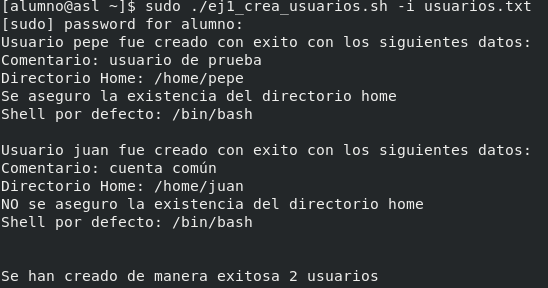
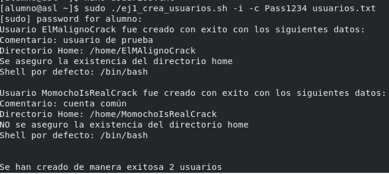

Este archivo contiene la solución completa del Obligatorio de Programación para DevOps 2025, compuesto por:

Ejercicio 1 (Bash):
Script que automatiza la creación de usuarios en Linux a partir de un archivo de entrada, aplicando verificaciones, manejo de errores y opciones adicionales de ejecución.

Incluye:
-	Shell por defecto. 
-	Directorio home. 
-	Comentario asociado al usuario. 
-	Opción para crear el directorio home si no existe. 
-	Además, incluye opciones para: 
-	Informar el resultado de la creación de cada usuario. 
-	Asignar una contraseña común a todos los usuarios. 

Ejercicio 2 (Python + AWS)

Automatización del despliegue completo de una aplicación de Recursos Humanos en AWS, asegurando la correcta gestión de datos sensibles.

Incluye:
-	Preparación del entorno local y archivos de la aplicación.
-	Subida del contenido web a un bucket S3.
-	Creación de Security Groups para aislar la capa web y la base de datos.
-	Aprovisionamiento de una instancia MySQL en AWS RDS con cifrado y backups.
-	Lanzamiento de una instancia EC2 con instalación automática de Apache y PHP.
-	Sincronización de archivos desde S3, configuración del archivo .env y carga    opcional del script SQL inicial.
-	Protección de credenciales mediante inputs y permisos seguros en la instancia.


Estructura del repositorio:

```bash

obligatorio-devops-2025/
├── ejercicio1/
│   ├── Docs/
│   │   ├── Salida_ejecucion.png
│   │   └── salida_ejecucion_ambos_modificadores.png
│   ├── ej1_crea_usuarios.sh
│   └── usuarios.txt
│
├── ejercicio2/
│   ├── ejercicio2.py
│   └── ArchivosWeb/
│
├── .gitignore
└── README.md

     
```

Link del repositorio: https://github.com/marcodm104/obligatorio-devops-2025

Gestión del repositorio y uso de ramas:

main: rama principal con la versión final y estable del proyecto

ej2-python: usada para desarrollar y probar el Ejercicio 2 sin afectar la rama principal.

documentacion: destinada a la elaboración del README, incorporación de imágenes y ajustes finales.

Cada rama se desarrolló de forma independiente y, una vez que los cambios estaban completos, se integraron en main mediante merges directos, resolviendo los conflictos que surgieron durante el proceso.
Este flujo permitió trabajar de forma ordenada y mantener control sobre cada parte del proyecto.

Cuando todos los cambios quedaron unificados y verificados, las ramas de trabajo fueron eliminadas para dejar el repositorio limpio y con una única versión final.
El historial de commits y merges permanece disponible como evidencia del proceso de desarrollo y del uso de buenas prácticas de control de versiones.

Requisitos / Dependencias

Ejercicio 1 (Bash)

Debe ejecutarse en un entorno Linux con:
- bash 4.x o superior
- permisos para crear usuarios
- archivo de entrada con formato: nombre:comentario:/home/directorio:SI|NO

------------------------------------------------------------------------

Uso del script

ejecución del script:

./ej1_crea_usuarios.sh [-i] [-c contraseña] archivo_usuarios

Formato del archivo de entrada (usuarios.txt):

Cada línea debe contener 5 campos, separados por “:”

ejemplo:

usuario:comentario:home:SI|NO:shell

------------------------------------------------------------------------

El script utiliza códigos de salida específicos para identificar fallas:

| Código | Motivo     | Descripción                                |
|--------|------------|--------------------------------------------|
| 10     | Parámetros | Cantidad incorrecta de parámetros          |
| 11     | Parámetros | Falta contraseña tras -c                   |
| 12     | Parámetros | Modificador inválido                       |
| 13     | Archivo    | No se proporcionó archivo de entrada       |
| 20     | Archivo    | El archivo no existe                       |
| 21     | Archivo    | El archivo no es regular                   |
| 22     | Archivo    | Sin permisos de lectura                    |
| 30     | Formato    | Cantidad incorrecta de campos              |
| 31     | Formato    | Campo "SI/NO" inválido                     |

------------------------------------------------------------------------

Ubicacion del script en el sistema:

C:\Users\Marco Aurelio\Documents\devops\obligatorio-devops-2025\ejercicio1

------------------------------------------------------------------------

Ejemplo salida real de la ejecución.

El script fue probado en una máquina virtual Centos 8.1, verificando su correcto funcionamiento.

Prueba con modificador -i:



Prueba utilizando ambos modificadores y asignando contraseña (-i y -c)



---------------------------------------------------------------------------------

Codigo ejercicio 1 (bash)

```bash

#!/bin/bash

INFO=0
USAR_PASS=0
PASS=""

# ---- Validar cantidad de parámetros ----
if [ $# -lt 1 ] || [ $# -gt 4 ]; then
    echo "uso: $0 [-i] [-c contraseña] archivo_usuarios" >&2
    exit 10
fi

# ---- Procesar modificadores ----
while [ "${1#-}" != "$1" ]; do
    case "$1" in
        -i)
            INFO=1
            shift
            ;;
        -c)
            if [ -z "$2" ]; then
                echo "Error: te falta contraseña" >&2
                exit 11
            fi
            USAR_PASS=1
            PASS="$2"
            shift 2
            ;;
        *)
            echo "Error: modificador invalido: $1" >&2
            exit 12
            ;;
    esac
done

# ---- Debe quedar solo el archivo ----
if [ $# -ne 1 ]; then
    echo "Error: Falta el archivo"
    exit 13
fi

ARCHIVO="$1"

# ---- Verificaciones del archivo ----
if [ ! -e "$ARCHIVO" ]; then
    echo "Error: El archivo '$ARCHIVO' no existe" >&2
    exit 20
fi

if [ ! -f "$ARCHIVO" ]; then
    echo "Error: El archivo no es regular." >&2
    exit 21
fi

if [ ! -r "$ARCHIVO" ]; then
    echo "Error: No hay permisos de lectura sobre el archivo." >&2
    exit 22
fi

CREADOS=0

# ---- Bucle principal ----
while IFS= read -r linea
do
    # Saltar líneas vacías
    [ -z "$linea" ] && continue

    # Contar cantidad de ':' (tienen que ser 4)
    CANT_2PUNTOS=$(echo "$linea" | tr -cd ':' | wc -c)
    if [ "$CANT_2PUNTOS" -ne 4 ]; then
        echo "Error: cantidad de campos en linea '$linea' incorrecta" >&2
        exit 30
    fi

    # Partir la línea en 5 campos usando IFS y set
    OLD_IFS="$IFS"
    IFS=':'
    set -- $linea    # ahora: $1=USUARIO, $2=COMENTARIO, $3=HOME, $4=CREAR_HOME, $5=SHELL_DEF
    IFS="$OLD_IFS"

    USUARIO="$1"
    COMENTARIO="$2"
    HOME="$3"
    CREAR_HOME="$4"
    SHELL_DEF="$5"

    # ---- Crear usuario según los campos ----
    # -c "$COMENTARIO" si hay comentario.
    # -d "$HOME" si hay home.
    # -m / -M según se quiera crear o no el home.
    # -s "$SHELL_DEF" si hay shell específica.

    if [ -z "$HOME" ]; then
        # Sin home definido
        if [ -z "$SHELL_DEF" ]; then
            if [ -z "$COMENTARIO" ]; then
                useradd "$USUARIO"
            else
                useradd -c "$COMENTARIO" "$USUARIO"
            fi
        else
            if [ -z "$COMENTARIO" ]; then
                useradd -s "$SHELL_DEF" "$USUARIO"
            else
                useradd -c "$COMENTARIO" -s "$SHELL_DEF" "$USUARIO"
            fi
        fi
    else
        # Con home definido
        if [ "$CREAR_HOME" = "SI" ]; then
            CREAR_DIR="-m"
        elif [ "$CREAR_HOME" = "NO" ]; then
            CREAR_DIR="-M"
        elif [ -z "$CREAR_HOME" ]; then
            CREAR_DIR=""
        else
            echo "Error: el campo crear home tiene un valor invalido: $CREAR_HOME" >&2
            exit 31
        fi

        if [ -z "$SHELL_DEF" ]; then
            if [ -z "$COMENTARIO" ]; then
                useradd $CREAR_DIR -d "$HOME" "$USUARIO"
            else
                useradd $CREAR_DIR -d "$HOME" -c "$COMENTARIO" "$USUARIO"
            fi
        else
            if [ -z "$COMENTARIO" ]; then
                useradd $CREAR_DIR -d "$HOME" -s "$SHELL_DEF" "$USUARIO"
            else
                useradd $CREAR_DIR -d "$HOME" -c "$COMENTARIO" -s "$SHELL_DEF" "$USUARIO"
            fi
        fi
    fi

    RESULTADO=$?   # código de salida de useradd

    if [ "$RESULTADO" -eq 0 ]; then
        CREADOS=$((CREADOS + 1))

        if [ "$USAR_PASS" -eq 1 ]; then
            echo "$USUARIO:$PASS" | chpasswd
        fi

        if [ "$INFO" -eq 1 ]; then
            echo "Usuario $USUARIO fue creado con exito con los siguientes datos:"

            if [ -z "$COMENTARIO" ]; then
                echo "Comentario: Sin comentario"
            else
                echo "Comentario: $COMENTARIO"
            fi

            if [ -z "$HOME" ]; then
                echo "Directorio por defecto"
            else
                echo "Directorio Home: $HOME"
                if [ "$CREAR_HOME" = "SI" ]; then
                    echo "Se aseguro la existencia del directorio home"
                else
                    echo "NO se aseguro la existencia del directorio home"
                fi
            fi

            if [ -z "$SHELL_DEF" ]; then
                echo "Shell por defecto"
            else
                echo "Shell por defecto: $SHELL_DEF"
            fi

            echo
        fi
    else
        if [ "$INFO" -eq 1 ]; then
            echo "El usuario $USUARIO no se pudo crear"
            echo
        fi
    fi
done < "$ARCHIVO"

echo
echo "Se han creado de manera exitosa $CREADOS usuarios"
```

El script cumple con todos los requisitos solicitados: creación de usuarios, validación de parámetros, manejo de errores, modularidad y evidencia real de ejecución.
La ejecución fue probada en un entorno Linux real, y los usuarios fueron creados correctamente siguiendo el formato establecido.

------------------------------------------------------------------------

Requisitos / Dependencias

Para que el script pueda ejecutarse sin problemas, es necesario contar con un entorno previamente configurado tanto a nivel local como en la plataforma de AWS.
En el equipo donde se ejecute el programa se debe disponer de Python 3 y de las librerías necesarias para interactuar con los servicios de la nube. En particular, se utilizan los módulos boto3 y botocore, que permiten crear, administrar y consultar recursos de AWS directamente desde el código. Ambos paquetes pueden instalarse mediante:

pip install boto3 botocore

Además del entorno de Python, se requiere que la AWS CLI esté instalada y correctamente configurada con un usuario que cuente con permisos suficientes para aprovisionar infraestructura. Las credenciales asociadas deben habilitar acciones sobre los servicios utilizados en el despliegue, tales como Amazon S3, EC2 y RDS. Sin estas políticas, el script no podrá crear ni modificar los recursos necesarios.

También es indispensable contar con la carpeta local que contiene los archivos de la aplicación web, la cual el script sincroniza automáticamente hacia el bucket de S3. Dichos archivos deben ubicarse dentro del directorio ArchivosWeb, manteniendo la estructura prevista para que el servidor web pueda procesarlos correctamente.

En conjunto, estas dependencias, tanto de software como de configuración en AWS garantizan que el script pueda ejecutar todas las etapas del despliegue de forma segura, automatizada y sin errores.

------------------------------------------------------------------------
Funcionalidad y medidas de seguridad

El script desarrollado en Python tiene como finalidad automatizar todo el proceso de despliegue de la aplicación de Recursos Humanos dentro de la infraestructura de AWS. Para lograrlo, se emplea la librería boto3, que permite crear y configurar servicios en la nube siguiendo principios de Infraestructura como Código, garantizando un despliegue repetible, ordenado y seguro.

El proceso comienza con la preparación del contenido web: el script verifica la existencia de la carpeta local de la aplicación y carga todos los archivos necesarios en un bucket de Amazon S3. Esto permite que la instancia EC2, que se aprovisionará más adelante, pueda descargar y ejecutar la aplicación sin intervención manual.

Luego, el script crea los grupos de seguridad que definen el flujo de tráfico dentro del entorno. Por un lado, se configura un Security Group para la capa web, permitiendo únicamente tráfico HTTP desde cualquier origen. Por otro, se genera un Security Group específico para la base de datos, el cual restringe completamente las conexiones externas y solo admite solicitudes provenientes del servidor web. Esta separación entre capas reduce significativamente la superficie de ataque y asegura un aislamiento adecuado entre servicios.

A continuación, se provisiona una base de datos MySQL mediante Amazon RDS. La instancia es creada con almacenamiento cifrado, backups automáticos habilitados y parámetros que refuerzan la seguridad, cumpliendo con los requisitos de protección de datos sensibles. El endpoint de la base de datos se obtiene dinámicamente una vez que el servicio está disponible, lo que permite integrarlo automáticamente con la instancia EC2.

Durante el lanzamiento de la instancia EC2, el script genera un User Data personalizado que se ejecuta al iniciar el servidor. Este User Data instala Apache, PHP y los complementos requeridos, descarga los archivos de la aplicación desde S3, configura los permisos adecuados, genera el archivo .env con las credenciales necesarias y ejecuta el script SQL init_db.sql si está presente. Todo este proceso asegura que la aplicación quede completamente funcional al terminar el aprovisionamiento.

A diferencia de otras implementaciones que almacenan credenciales en archivos externos, este script solicita la contraseña directamente al usuario mediante un input interactivo, evitando que quede en el repositorio o en el sistema de archivos. Esto reduce el riesgo de exposición accidental y elimina la necesidad de manejar archivos sensibles.

Además, las credenciales se escriben únicamente dentro del archivo .env en la instancia EC2, el cual se genera con permisos estrictos (600) para impedir su lectura por parte de otros usuarios del sistema.
---------------------------------------------------------------------
Modo de uso y ejemplo de ejecucion

Para ejecutar el script hay que ubicarse en el directorio donde se encuentra el archivo del ejercicio y ejecutar en la terminal:

Python ej2.py


Una vez ejecutado hay que asignar un nombre para el bucket (Tiene que ser unico) y luego escribir una contraseña para la base de datos.

Al comenzar, el script va mostrando en pantalla el avance de cada una de las etapas del despliegue. Inicialmente se encarga de verificar y cargar los archivos de la aplicación en el bucket de S3, indicando si el bucket ya existía o si fue creado durante la ejecución.

Luego continúa con la creación de los Security Groups correspondientes a la capa web y a la base de datos. Una vez configurada la red, el script procede a desplegar la instancia RDS y mantiene informado al usuario durante el tiempo de espera hasta que quede completamente operativa.

Con la base de datos disponible, se inicia el aprovisionamiento de la instancia EC2. Tras unos segundos adicionales para permitir la inicialización completa, el script obtiene la dirección IP pública de la instancia.
Finalmente, se imprime en pantalla la URL de acceso a la aplicación, confirmando que todos los recursos fueron creados y configurados correctamente.
 
Una vez obtenida la URL de la app, se pega en un navegador y se ingresa al login.php. Luego, ingresamos con usuario y contraseña y accedemos a la app.
Una vez realizado el login, ya tendríamos acceso a la web (En este ejemplo ip 18.209.22.62)


Para corroborar el funcionamiento se eliminaron usuarios y se creó uno nuevo.
 
----------------------------------------------------------------------
Ubicacion del script en el sistema:

C:\Users\Marco Aurelio\Documents\devops\obligatorio-devops-2025\ejercicio2

-------------------------------------------------------------------------
```python
Codigo ejercicio 2

import boto3                    
import os                       
import time                     
from botocore.exceptions import ClientError  

# ========================
# Variables globales
# ========================

BUCKET_NAME = input("Ingrese el nombre del bucket S3: ").strip()  
LOCAL_FOLDER = './ArchivosWeb'                                     
S3_PREFIX = 'appweb/'                                              
DB_INSTANCE_ID = 'rrhh-rds-instancia'  
DB_USERNAME = 'admin'                                              
DB_NAME = 'demo_db'                                                
DB_PASSWORD = input("Ingrese la contraseña para la base de datos (mínimo 8 caracteres): ").strip()
EC2_IMAGE_ID = 'ami-0fa3fe0fa7920f68e'                            

# Clientes de AWS
ec2_client = boto3.client('ec2')
rds_client = boto3.client('rds')
s3_client = boto3.client('s3')


# =======================================
# Subir archivos al bucket S3
# =======================================
def upload_web_files():
    print("\nSubiendo archivos web al bucket S3...")

    # Verifica que la carpeta exista
    if not os.path.isdir(LOCAL_FOLDER):
        print(f"La carpeta NO existe: {LOCAL_FOLDER}")
        exit(1)

    try:
        # Intenta crear el bucket
        s3_client.create_bucket(Bucket=BUCKET_NAME)
        print(f"Bucket creado correctamente: {BUCKET_NAME}")
    except Exception as e:
        # Si ya existe y es del usuario, se reutiliza
        if "BucketAlreadyOwnedByYou" in str(e):
            print("ℹ El bucket ya existe y es de su propiedad.")

    # Recorre recursivamente todos los archivos dentro de LOCAL_FOLDER
    for root, dirs, files in os.walk(LOCAL_FOLDER):
        for filename in files:
            local_path = os.path.join(root, filename)    # Ruta completa local
            # Ruta relativa respecto a LOCAL_FOLDER (para mantener estructura)
            s3_key = os.path.relpath(local_path, LOCAL_FOLDER).replace("\\", "/")
            # Ruta final en S3: appweb/<ruta_relativa>
            s3_path = f"{S3_PREFIX}{s3_key}"

            print(f"Subiendo: {local_path} -> s3://{BUCKET_NAME}/{s3_path}")
            s3_client.upload_file(local_path, BUCKET_NAME, s3_path)  # Subir archivo

    print("Archivos web subidos exitosamente al bucket S3.\n")


# ===============================================================
# Crear un Security Group (SG) con reglas de ingreso especificadas
# ===============================================================
def create_security_group(group_name, description, ingress_rules):
    group_id = None
    try:
        response = ec2_client.create_security_group(
            GroupName=group_name,
            Description=description
        )
        group_id = response['GroupId']                   # ID del SG creado

        ec2_client.authorize_security_group_ingress(     # Agregar reglas
            GroupId=group_id,
            IpPermissions=ingress_rules
        )
    except ClientError as e:
        if e.response['Error']['Code'] == 'InvalidGroup.Duplicate':
            # Si el SG ya existe, recuperamos su ID
            existing = ec2_client.describe_security_groups(GroupNames=[group_name])
            group_id = existing['SecurityGroups'][0]['GroupId']
    return group_id


# ===============================================================
# Configurar los SG para Web y Base de Datos
# ===============================================================
def setup_security_groups():
    # SG para el servidor web
    web_sg_name = 'rrhh-web-sg'
    web_sg_id = create_security_group(
        web_sg_name,
        'Grupo de seguridad para el servidor web RRHH',
        [
            {
                'IpProtocol': 'tcp',                     # Protocolo HTTP
                'FromPort': 80,
                'ToPort': 80,
                'IpRanges': [{'CidrIp': '0.0.0.0/0'}]    # Acceso público
            }
        ]
    )

    # SG para RDS que solo permite tráfico desde el SG Web
    db_sg_name = 'rrhh-db-sg'
    db_sg_id = create_security_group(
        db_sg_name,
        'Grupo de seguridad para la base de datos RRHH',
        [
            {
                'IpProtocol': 'tcp',
                'FromPort': 3306,
                'ToPort': 3306,
                'UserIdGroupPairs': [{'GroupId': web_sg_id}]   # Solo EC2 Web accede
            }
        ]
    )

    return web_sg_id, db_sg_id


# ===============================================================
# Crear instancia RDS MySQL
# ===============================================================
def create_rds_instance(db_sg_id):
    try:
        rds_client.create_db_instance(
            DBInstanceIdentifier=DB_INSTANCE_ID,
            DBInstanceClass='db.t3.micro',
            Engine='mysql',
            MasterUsername=DB_USERNAME,
            MasterUserPassword=DB_PASSWORD,
            DBName=DB_NAME,
            AllocatedStorage=20,
            StorageType='gp2',
            StorageEncrypted=True,               # Cifrado en reposo
            VpcSecurityGroupIds=[db_sg_id],      # SG asociado
            BackupRetentionPeriod=7,             # Backups automáticos
            PubliclyAccessible=True              
        )
        print("Instancia RDS creada: esperando a que esté disponible...")

        waiter = rds_client.get_waiter('db_instance_available')  # Espera hasta que RDS esté lista
        waiter.wait(DBInstanceIdentifier=DB_INSTANCE_ID)

    except ClientError as e:
        if e.response['Error']['Code'] == 'DBInstanceAlreadyExists':
            print(f"ℹ La instancia RDS ya existe: {DB_INSTANCE_ID}")
        else:
            print("Error creando la instancia RDS:", e)
            raise

    info = rds_client.describe_db_instances(DBInstanceIdentifier=DB_INSTANCE_ID)
    return info['DBInstances'][0]['Endpoint']['Address']   # Retorna el endpoint


# ===============================================================
# Generar script User Data para inicializar EC2
# ===============================================================
def generate_userdata_script(db_endpoint):
    # Este script se ejecuta automáticamente cuando EC2 inicia.
    return f'''#!/bin/bash
yum update -y
yum install -y httpd php php-cli php-fpm php-common php-mysqlnd mariadb105 awscli

systemctl enable --now httpd
systemctl enable --now php-fpm

# Configurar PHP-FPM con Apache
echo '<FilesMatch \\\\.php$>
  SetHandler "proxy:unix:/run/php-fpm/www.sock|fcgi://localhost/"
</FilesMatch>' | tee /etc/httpd/conf.d/php-fpm.conf

rm -rf /var/www/html/*

# Sincroniza desde appweb/ (coincide con S3_PREFIX)
aws s3 sync s3://{BUCKET_NAME}/appweb/ /var/www/html/

# Copiar SQL inicial si existe
if [ -f /var/www/html/init_db.sql ]; then
  cp /var/www/html/init_db.sql /var/www/
fi

# Crear archivo .env con credenciales
if [ ! -f /var/www/.env ]; then
cat > /var/www/.env << 'EOT'
DB_HOST={db_endpoint}
DB_NAME={DB_NAME}
DB_USER={DB_USERNAME}
DB_PASS={DB_PASSWORD}
EOT
fi

chown apache:apache /var/www/.env
chmod 600 /var/www/.env

chown -R apache:apache /var/www/html
chmod -R 755 /var/www/html

# Ejecutar script SQL inicial si está presente
if [ -f /var/www/init_db.sql ]; then
  mysql -h {db_endpoint} -u {DB_USERNAME} -p{DB_PASSWORD} {DB_NAME} < /var/www/init_db.sql
fi

systemctl restart httpd php-fpm
'''


# ===============================================================
# Lanzar instancia EC2
# ===============================================================
def launch_ec2_instance(web_sg_id, userdata_script):
    response = ec2_client.run_instances(
        ImageId=EC2_IMAGE_ID,
        InstanceType='t2.micro',
        MinCount=1,
        MaxCount=1,
        IamInstanceProfile={'Name': 'LabInstanceProfile'},
        SecurityGroupIds=[web_sg_id],
        UserData=userdata_script,
        BlockDeviceMappings=[
            {
                'DeviceName': '/dev/xvda',
                'Ebs': {
                    'VolumeSize': 8,
                    'VolumeType': 'gp2',
                    'Encrypted': True
                }
            }
        ]
    )

    instance_id = response['Instances'][0]['InstanceId']

    # Etiquetas
    ec2_client.create_tags(
        Resources=[instance_id],
        Tags=[
            {'Key': 'Name', 'Value': 'app-rrhh'},
            {'Key': 'Application', 'Value': 'RRHH'},
            {'Key': 'DataClassification', 'Value': 'Confidencial'}
        ]
    )

    return instance_id


# ===============================================================
# Obtener IP pública de una EC2
# ===============================================================
def get_instance_public_ip(instance_id):
    print("\nObteniendo la dirección IP pública de la instancia EC2...")
    time.sleep(15)  # Espera básica para que la IP se asigne y los servicios levanten
    info = ec2_client.describe_instances(InstanceIds=[instance_id])
    return info['Reservations'][0]['Instances'][0].get('PublicIpAddress')


# ===============================================================
# Función principal
# ===============================================================
def main():
    upload_web_files()                               # Subir app a S3
    web_sg_id, db_sg_id = setup_security_groups()    # Crear SGs
    db_endpoint = create_rds_instance(db_sg_id)      # Crear RDS y obtener endpoint
    userdata = generate_userdata_script(db_endpoint) # Generar User Data
    instance_id = launch_ec2_instance(web_sg_id, userdata)  # Lanzar EC2
    public_ip = get_instance_public_ip(instance_id)  # Obtener IP pública

    print(f"\nURL de acceso a la aplicación web: http://{public_ip}/login.php")
    print("====================================")


if __name__ == "__main__":
    main()

```
----------------------------------------------------------------------

